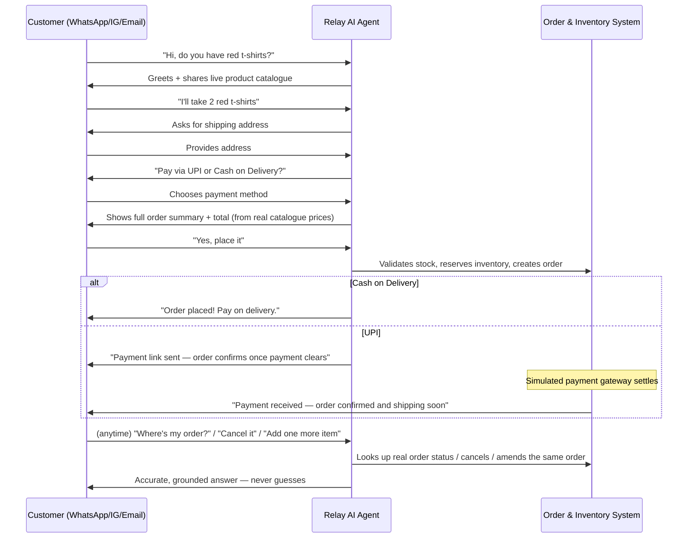

# Relay
### The autonomous AI sales agent for chat-first commerce

*Product overview & app flow — investor briefing*

---

## 1. The Problem

Small and mid-sized businesses now sell primarily through **chat** — WhatsApp, Instagram DMs, email — not storefronts. But chat-based selling doesn't scale:

- Every inbound message needs a human to read it, find the product, quote a price, collect an address, confirm payment, and manually log the order.
- Replies are slow (minutes to hours), so warm leads go cold and buyers abandon the conversation.
- There is no CRM, no lead scoring, no order pipeline, and no analytics behind a WhatsApp inbox — just a phone and a spreadsheet.
- Hiring a 24/7 chat support/sales team is expensive and doesn't scale with demand spikes.

**The business either loses the sale, or burns headcount just to keep up with chat.**

---

## 2. The Solution

**Relay is an autonomous AI sales agent that lives inside a business's chat channels.** It doesn't draft replies for a human to approve — it greets the customer, answers product questions, negotiates the order, collects the shipping address, takes the payment decision, places the order, and keeps the customer updated — end to end, with zero human intervention required.

Behind the AI agent sits a full commerce back office: a real product catalogue with live inventory, a real order pipeline with payment and fulfillment tracking, a CRM with automatic lead scoring, and a dashboard that shows the business owner exactly what their AI is doing and how much revenue it's generating.

**Relay turns every chat message into a monitored, revenue-generating conversation — automatically.**

---

## 3. Product Description

Relay is a multi-tenant SaaS platform with three parts:

| Layer | What it does |
|---|---|
| **Chat channels** | WhatsApp, Instagram DM, and Email — customers message the business exactly as they do today, no new app to install |
| **Autonomous AI agent** | Reads every inbound message, reasons over the product catalogue and the customer's order history, and replies immediately — negotiating, confirming, and placing real orders without a human approving each reply |
| **Command center dashboard** | The business owner's control room — live inbox, leads, products, orders, automations, and revenue analytics, all backed by the same data the AI agent acts on |

It is built for businesses that sell **physical products conversationally** — fashion, D2C, local retail — where the entire purchase decision happens inside a chat thread.

---

## 4. The Complete App Flow

### 4.1 End-customer journey (fully autonomous, no human touches this)

Every one of these steps is handled by the AI with **no draft-and-approve step, no missed message, and no double-booked order** — the agent tracks exactly what's already been confirmed so a retried message or a follow-up question never creates a duplicate order.

### 4.2 Business owner journey (the command center)

The business owner never has to write a reply. They log in to **watch performance**, manage the **product catalogue and inventory**, and see **which conversations turned into revenue** — all without touching a single chat.

---

## 5. What Makes Relay Different

- **Fully autonomous, not "AI-assisted."** Most competitors generate a draft reply for a human to approve. Relay sends the reply itself — the whole point is removing the human bottleneck.
- **Real commerce logic, not just a chatbot.** Inventory is checked and reserved server-side before every order — not just "trusted" to the AI's judgement. Orders can be amended and cancelled mid-conversation without creating duplicates or double-charging stock.
- **Grounded, not hallucinated.** Every "where's my order" or "what's in stock" answer is generated from the actual database record at that moment — the AI is never allowed to invent a price, a policy, or an order status.
- **Channel-agnostic by design.** The same AI sales flow runs identically over WhatsApp, Instagram, and Email — a business isn't locked into one channel.
- **Full-funnel visibility.** Every message, order, and lead-score change is logged to a unified activity timeline, so the business owner has a real CRM — not just a chat log.

---

## 6. Under the Hood (built, working, demo-ready today)

| Capability | Status |
|---|---|
| WhatsApp — inbound/outbound, fully autonomous AI replies | ✅ Live, tested on real WhatsApp numbers |
| Instagram DM + Email channels | ✅ Built, ready to activate with channel credentials |
| Conversational order flow (greeting → items → address → payment → summary → confirmation) | ✅ Live |
| Server-side inventory enforcement (stock reserved/released automatically) | ✅ Live |
| Order amendment & cancellation via chat, with no duplicate orders | ✅ Live |
| Grounded order-status answers from real order data | ✅ Live |
| UPI payment-link generation + payment-confirmation flow | ✅ Live (simulated payment gateway — real gateway integration is the next milestone) |
| Automated payment/shipment status progression | ✅ Live (simulated timers — real courier webhook integration is the next milestone) |
| CRM: leads, customers, automatic lead scoring, unified activity timeline | ✅ Live |
| Dashboard: Inbox, Leads, Products, Orders, Automations, Analytics, Settings | ✅ Live |
| Real-time revenue analytics (daily sales graph, funnel, channel mix) | ✅ Live |
| Multi-tenant auth, rate limiting, security hardening | ✅ Live |

**Architecture:** a modern, horizontally-scalable stack — Next.js dashboard, NestJS API, PostgreSQL for the system of record, Redis/BullMQ for asynchronous order and follow-up processing, and OpenAI for the conversational and decision-making layer. Built as a monorepo so the web app, API, and background workers ship and scale independently.

---

## 7. Roadmap

1. **Real payment gateway integration** (Razorpay) — replace the simulated UPI link with live payment collection and webhook-driven confirmation.
2. **Real courier integration** — live shipment tracking replacing the simulated fulfillment timer.
3. **Shopify / storefront sync** — two-way catalogue and inventory sync for merchants who already run a storefront.
4. **Multi-user roles & permissions** — teams, not just single-owner businesses.
5. **Production infrastructure** — containerized deployment, observability, and horizontal scaling for multi-tenant load.

---

## 8. Why Now

Conversational commerce is how the next generation of small and mid-sized businesses already sell — the tooling around it just hasn't caught up. Large language models have only recently become reliable enough to hold a multi-turn sales conversation, correctly track state (what's been agreed, what hasn't), and make a real-world decision — like placing an order — without constant human supervision. Relay is built specifically to exploit that reliability threshold: fully autonomous selling, grounded in real inventory and order data, with the guardrails to make it safe to run unattended.

---

*This document reflects the product as built and verified in the current codebase. Figures such as market size, pricing, and funding ask are intentionally left for the founding team to complete with sourced, verifiable data.*
